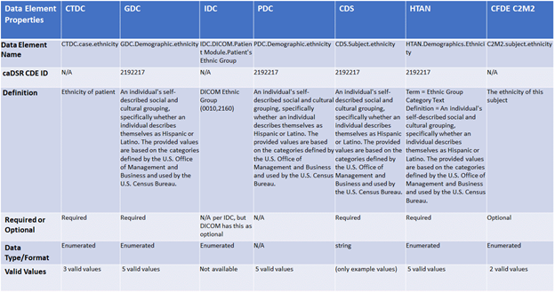
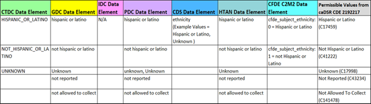

**CRDC-DataStandards-RFC01: Subject Ethnicity**

FOR ADMIN USE ONLY

<table>
<colgroup>
<col style="width: 50%" />
<col style="width: 50%" />
</colgroup>
<thead>
<tr class="header">
<th><strong>Version Number</strong></th>
<th>0.1</th>
</tr>
</thead>
<tbody>
<tr class="odd">
<td><strong>Submitting Team</strong></td>
<td>CRDC Data Standards Services (DSS) Team</td>
</tr>
<tr class="even">
<td>
<strong>RFC Status</strong>

<em>(when Status is “Released”, must add the NCI caDSR CDE Public
ID)</em>
</td>
<td>
☒ Open for Comments

☐ Released

CDE Public IDs: n/a
</td>
</tr>
<tr class="odd">
<td>
<strong>Comment Period <em>(MM/DD/YY)</em></strong>

<em>(each round of comment for a data element will have its own
comment period)</em>
</td>
<td>
<strong>Start Date</strong>: 05/02/22

<strong>End Date</strong>: 05/13/2022
</td>
</tr>
<tr class="even">
<td><strong>URL link to this document</strong></td>
<td>[ADD THE GOOGLE DOCS LINK]</td>
</tr>
</tbody>
</table>

**CRDC Component Review Community**

| **Component Name** | **Reviewer Name** | **Reviewer Role** |
|--------------------|-------------------|-------------------|
| **CDA**            |                   |                   |
| **CDS**            |                   |                   |
| **CTDC**           |                   |                   |
| **GDC**            |                   |                   |
| **ICDC**           |                   |                   |
| **IDC**            |                   |                   |
| **PDC**            |                   |                   |

# 

# Introduction

The goal of the Data Standards Services (DSS) Project is to work with
representatives across the CRDC and its communities to develop CRDC data
standards that enable interoperability across the CRDC
data repositories. The primary focus is on harmonizing the 30 DST data
elements across the following six CRDC Components to support the
cross-node data aggregation needs of the researcher -
[CDS](https://datacommons.cancer.gov/repository/cancer-data-service),
[CTDC](https://datacommons.cancer.gov/repository/clinical-trial-data-commons)
, [GDC](https://datacommons.cancer.gov/repository/genomic-data-commons),
[ICDC](https://datacommons.cancer.gov/repository/integrated-canine-data-commons),
[IDC](https://datacommons.cancer.gov/repository/imaging-data-commons) &
[PDC](https://datacommons.cancer.gov/repository/proteomic-data-commons)

A secondary focus is to include a few key external initiatives in this
analysis to help enable interoperability with other CRDC stakeholders -
[HTAN](https://humantumoratlas.org/),
[CFDE-C2M2](file:///C:\Users\hastaks\Downloads\Common%20Fund%20Data%20Ecosystem's%20Crosscut%20Metadata%20Model)
& HL7
[mCODE](https://www.asco.org/news-initiatives/current-initiatives/cancer-care-initiatives/mcode-standard-data-ehr).

The DSS Project harmonization effort is bound to the **April 2022**
versions of the CRDC Repositories models. As the model semantics evolve
in the future, the DSS team will re-visit the harmonization analysis for
future versions of the CRDC data element standards.

# Purpose

The objective of this proposal is to solicit feedback and comments from
the various CRDC Component team members on the harmonized proposal of
the Subject Ethnicity data element. This should be considered as the
candidate CRDC Data Standard for Subject Ethnicity. The feedback
received through this request for comment (RFC) process will be
incorporated into defining the final version of the Subject Ethnicity
data element. Once finalized, the data element will be registered in the
NCI caDSR (metadata) repository and be identified as part of the CRDC
Data Dictionary.

# Community Guidelines for Review

-   Provide the comments using the MS Word Comment feature and
    <u>not</u> by editing the original text.

-   Review the data element proposal in next section. All aspects of the
    proposal for this data element are open to comment.

-   Review the proposed cross-mappings in Tables 1 & 2 (data elements
    and valid values) and comment on whether the mappings are correct.

# Data Element Proposal

-   **Name**:  Subject Ethnicity​

-   **Definition**:  An individual's self-described social and cultural
    grouping, specifically whether an individual describes themselves as
    Hispanic or Latino. The provided values are based on the categories
    defined by the U.S. Office of Management and Business and used by
    the U.S. Census Bureau \[Source: NCI CDE Public ID 2192217\]​

-   **Conformance:** Required (for Human subjects)

-   **Data Type**:  Enumerated​

-   **Valid Values**:​

| **Valid Value**        | **NCIt Concept Code**                                                                                                   |
|------------------------|-------------------------------------------------------------------------------------------------------------------------|
| Hispanic or Latino     | [C17459](https://ncithesaurus.nci.nih.gov/ncitbrowser/ConceptReport.jsp?dictionary=NCI_Thesaurus&ns=ncit&code=C17459)   |
| Not Hispanic or Latino | [C41222](https://ncithesaurus.nci.nih.gov/ncitbrowser/ConceptReport.jsp?dictionary=NCI_Thesaurus&ns=ncit&code=C41222)   |
| Unknown                | [C17998](https://ncithesaurus.nci.nih.gov/ncitbrowser/ConceptReport.jsp?dictionary=NCI_Thesaurus&ns=ncit&code=C17998)   |
| Not Reported           | [C43234](https://ncithesaurus.nci.nih.gov/ncitbrowser/ConceptReport.jsp?dictionary=NCI_Thesaurus&ns=ncit&code=C43234)   |
| Not Allowed To Collect | [C141478](https://ncithesaurus.nci.nih.gov/ncitbrowser/ConceptReport.jsp?dictionary=NCI_Thesaurus&ns=ncit&code=C141478) |

> *(Note: NCIt Concept codes are provided for reference only. They are
> not being proposed to use in the CRDC components)*

# Background Analysis

The Data Standards Services (DSS) Team has reviewed and cross-mapped
this data elements across all the relevant CRDC Repositories and the
external efforts. The proposed CRDC standard is based on this analysis.
The cross-mappings are provided in the sections below.

## Cross-Mapping of the data element across the repositories in scope

The table below (Table 1) shows the cross-mapping of the Subject
Ethnicity data elements across the seven repositories and/or CRDC
relevant external efforts. The CDE IDs identified in row 2 of the table
below is what was provided by the repositories.

Table
1 – Data Element cross-mapping

## 

## Cross-Mapping of the Valid/Acceptable values across the repositories in scope

The table below (Table 2) shows the cross-mapping of the acceptable
values or valid values for Subject Ethnicity. Since majority of the CRDC
Components referenced the same CDE ID, the last column of the table
provides the NCI caDSR equivalent permissible values for each acceptable
value from the CDE Public ID – 2192217. The Concept Code from NCI
Thesaurus ([NCIt](https://ncithesaurus.nci.nih.gov/ncitbrowser/)) for
each acceptable value is shown in the parenthesis.

Table 2 – Valid value cross-mapping

# DSS Team Questions for CRDC Components

1.  IDC Question – DSS team was not able to find a specific set of
    acceptable values for Ethnic Group (0010,2160). Does IDC define a
    list of acceptable values?

# Glossary

| caDSR     | Cancer Data Standards Repository                   |
|-----------|----------------------------------------------------|
| CDA       | Cancer Data Aggregator                             |
| CDS       | Cancer Data Commons                                |
| CFDE-C2M2 | Common Fund Data Ecosystem-Crosscut Metadata Model |
| CRDC      | Cancer Research Data Commons                       |
| CTDC      | Clinical Trials Data Commons                       |
| DSS       | Data Standards Services                            |
| DST       | Data Standards Team                                |
| GDC       | Genomic Data Commons                               |
| HTAN      | Human Tumor Atlas Network                          |
| ICDC      | Integrated Canine Data Commons                     |
| IDC       | Imaging Data Commons                               |
| mCODE     | Minimal Common Oncology Data Elements              |
| NCIt      | NCI Thesaurus                                      |
| PDC       | Proteomic Data Commons                             |
